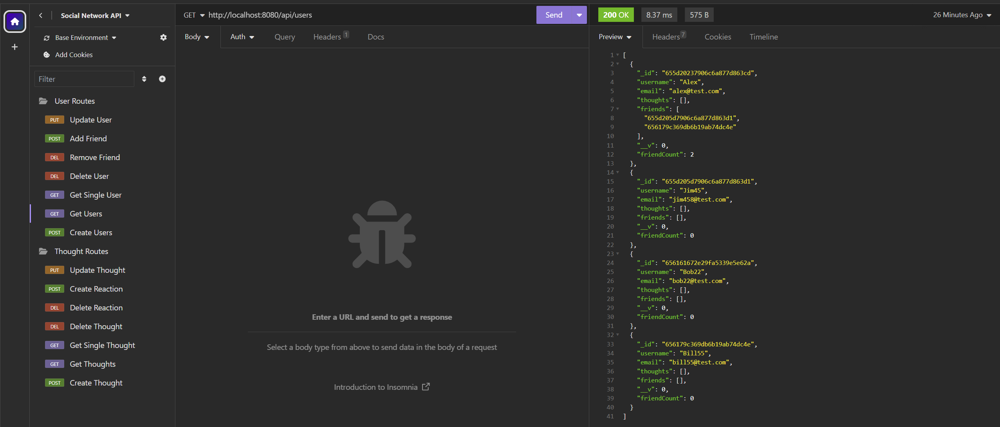

# Social-Network-API
## Overview

This project implements a robust API for a social networking web application using Express.js, MongoDB, and Mongoose. The API allows users to manage thoughts, reactions, and friend lists.
- Create, read, update, and delete users
- Add and remove friends from a user's friend list
- Create, read, update, and delete thoughts
- Add reactions to thoughts and manage them

## API Endpoints Visualization
Here is a visualization of the social network api endpoints using insomnia. GET, POST, PUT and DELTE routes can be seen for users and thoughts.

## Video Demonstration
See a video demonstration: [Watch Video](https://drive.google.com/file/d/1sRtYd8TcEOgz8f58CpKL-DOurVGx3t0X/view)
